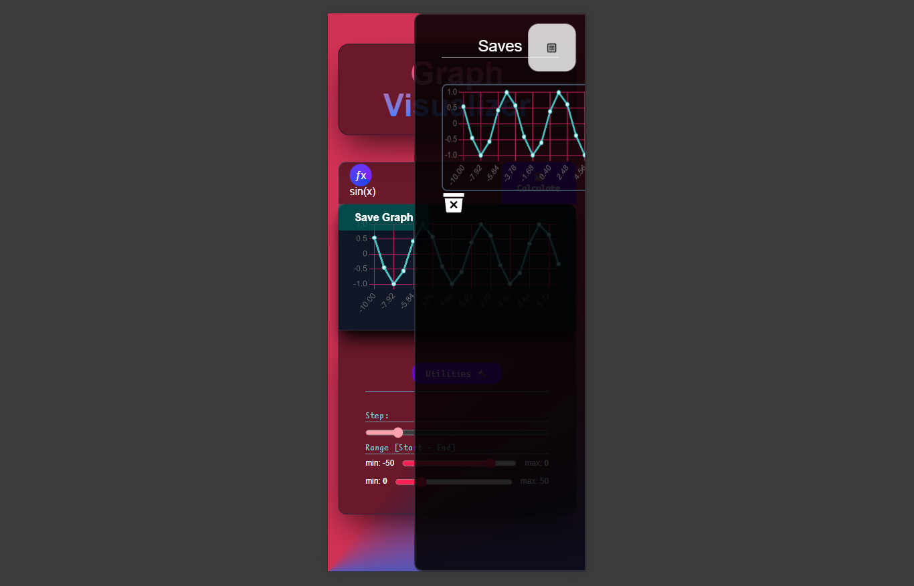

# **_henry759's portfolio_**

## What I Do:

I'm a developer focused on **_Web Application Development_** with hands-on experience in building modern backends and frontends.

## ⚙️ _Currently Focus_

I'm currently sharpening my skills in **Backend APIs** using FastAPI, and also working with Next.js and Tailwind for making responsive and modern UIs.

## 🫠 _About Me_

- I enjoy learning new technologies related with my interests. As a young developer I aim to grow quickly without losing productivity and patience.

## 🥷 _Skills_

### Splitted as _**📜 Layer**_ and _**⚙ Tech**_

| 📜Layer        | ⚙️Tech                   |
| -------------- | ------------------------ |
| _**Frontend**_ | _*Next.js, React*_       |
| **_Backend_**  | _*Python, FastAPI*_      |
| **_Styling_**  | _*Tailwind, SCSS, CSS3*_ |

## 🚀 Featured Project:

[Graph Visualizer](https://graphize.netlify.app)
is a **_web app_** that im currently developing, here are images from this project

